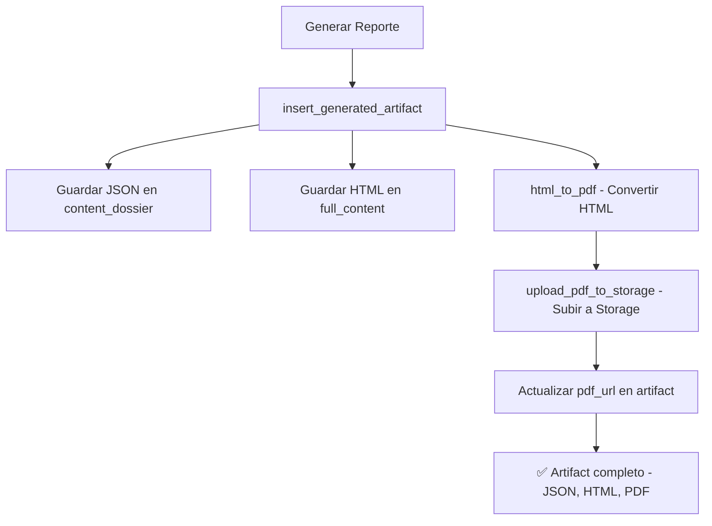

# 📄 Sistema de Generación Automática de PDFs

## 🎯 Resumen

Ahora **todos los reportes generados en Quantex** se guardan automáticamente en **3 formatos**:

1. **JSON** → En columna `content_dossier` (datos estructurados)
2. **HTML** → En columna `full_content` (visualización web)
3. **PDF** → En Supabase Storage (descarga/adjunto email)

---

## 🏗️ Arquitectura

### **Tabla: `generated_artifacts`**
```sql
- id (uuid)
- report_keyword (text)
- artifact_type (text)
- full_content (text) ← HTML
- content_dossier (jsonb) ← JSON
- pdf_url (text) ← NUEVA COLUMNA - URL del PDF
- ticker (text)
- created_at (timestamp)
```

### **Storage Bucket: `report-pdfs`**
```
report-pdfs/
├── comite_tecnico_cobre/
│   ├── 2025-10-19_HG=F_abc12345.pdf
│   └── 2025-10-18_HG=F_def67890.pdf
├── comite_tecnico_mercado/
│   └── 2025-10-19_CONSOLIDATED_abc12345.pdf
├── mesa_redonda/
│   └── 2025-10-19_peso_chileno_abc12345.pdf
└── fair_value/
    └── 2025-10-19_clp_abc12345.pdf
```

**Formato de nombre:** `{fecha}_{ticker}_{artifact_id_corto}.pdf`

---

## 🚀 Pasos de Implementación

### ✅ **1. Crear Bucket en Supabase (MANUAL)**

Ve a Supabase Dashboard → Storage → Create new bucket:
- **Name:** `report-pdfs`
- **Public:** ✅ Yes
- **File size limit:** 50 MB
- **Allowed MIME types:** `application/pdf`

### ✅ **2. Agregar columna `pdf_url` (MANUAL)**

Ejecuta este SQL en Supabase:

```sql
-- Ejecutar en Supabase SQL Editor
ALTER TABLE generated_artifacts 
ADD COLUMN IF NOT EXISTS pdf_url TEXT;

COMMENT ON COLUMN generated_artifacts.pdf_url 
IS 'URL pública del PDF generado en Supabase Storage (bucket: report-pdfs)';
```

O usa el archivo: `migrations/add_pdf_url_column.sql`

### ✅ **3. Librería instalada**

`weasyprint==66.0` ya está en `requirements.txt` (línea 61)

### ✅ **4. Código implementado**

En `quantex/core/database_manager.py`:

- ✅ Función `html_to_pdf()` → Convierte HTML a PDF
- ✅ Función `upload_pdf_to_storage()` → Sube PDF a Storage
- ✅ Función `insert_generated_artifact()` → Modificada para generar PDF automáticamente

---

## 🧪 Cómo Probar

### **Opción A: Script de prueba**

```bash
# Desde la raíz del proyecto
python test_pdf_generation.py
```

Este script:
1. Toma el último reporte de `comite_tecnico_cobre`
2. Genera su PDF
3. Lo sube a Storage
4. Actualiza el artifact con la URL

### **Opción B: Generar un nuevo reporte**

Simplemente genera cualquier reporte como siempre:

```python
from verticals.analisis_tecnico import engine_technical_committee

result = engine_technical_committee.run({
    'report_keyword': 'comite_tecnico_cobre'
})
```

El PDF se generará **automáticamente** 🎉

---

## 📦 Cómo Usar los PDFs

### **1. Para emails**

**Opción A: Link de descarga en el HTML**
```python
pdf_url = artifact['pdf_url']
email_html = f"""
<p>Tu reporte está listo.</p>
<p><a href="{pdf_url}">📄 Descargar PDF</a></p>
"""
```

**Opción B: Adjuntar el PDF directamente**
```python
import requests

pdf_url = artifact['pdf_url']
pdf_content = requests.get(pdf_url).content

# Luego adjuntar pdf_content al email con Gmail API
```

### **2. Para el Dashboard CRM**

Agregar botón de descarga en la tabla de reportes:

```typescript
<a href={report.pdf_url} download>
  📄 Descargar PDF
</a>
```

### **3. Para compartir manualmente**

Simplemente copia la URL pública del PDF:
```
https://ikhfknlyhuyygyvoofdu.supabase.co/storage/v1/object/public/report-pdfs/comite_tecnico_cobre/2025-10-19_HG=F_abc12345.pdf
```

Y compártela por:
- WhatsApp
- Email
- Slack
- Cualquier otro canal

---

## 🔧 Configuración Técnica

### **WeasyPrint**

Librería Python para convertir HTML a PDF:
- ✅ No requiere binarios externos (como wkhtmltopdf)
- ✅ Excelente soporte de CSS moderno
- ✅ Renderiza gráficos y tablas perfectamente
- ✅ Funciona en Windows sin configuración adicional

### **Supabase Storage**

Almacenamiento de archivos con:
- ✅ URLs públicas automáticas
- ✅ CDN integrado para descargas rápidas
- ✅ Versionamiento con `upsert: true`
- ✅ 1GB gratis en plan Free

---

## 📊 Flujo Completo



---

## ⚠️ Notas Importantes

1. **Retrocompatibilidad:** Si un reporte no tiene HTML (vacío o null), simplemente NO se genera PDF. No hay errores.

2. **Sobrescritura:** Si subes un PDF con el mismo nombre, se sobrescribe automáticamente (`upsert: true`).

3. **Tamaño de archivos:** El límite es 50MB por PDF. Los reportes típicos son < 2MB.

4. **Errores silenciosos:** Si falla la generación del PDF, el artifact se guarda igual (solo sin `pdf_url`). Los logs muestran el error.

5. **Rendimiento:** La generación de PDF toma ~2-5 segundos. No bloquea el sistema.

---

## 🐛 Troubleshooting

### **Problema: "Cliente de Supabase no disponible"**
**Solución:** Verifica que el archivo `.env` tiene `SUPABASE_URL` y `SUPABASE_SERVICE_KEY`.

### **Problema: "Error 403 al subir a Storage"**
**Solución:** Verifica que el bucket `report-pdfs` existe y es público.

### **Problema: "Error generando PDF: missing library"**
**Solución:** WeasyPrint requiere algunas librerías del sistema:

**Windows:**
```bash
# Ya está incluido en la instalación de weasyprint
```

**Linux:**
```bash
sudo apt-get install python3-dev python3-pip python3-cffi libcairo2 libpango-1.0-0 libpangocairo-1.0-0 libgdk-pixbuf2.0-0 libffi-dev shared-mime-info
```

**macOS:**
```bash
brew install cairo pango gdk-pixbuf libffi
```

### **Problema: "PDF se ve mal (CSS roto)"**
**Solución:** WeasyPrint tiene algunas limitaciones con CSS. Si el HTML usa CSS muy moderno, considera simplificar los estilos para PDFs.

---

## 📝 TODO Futuro (Opcional)

- [ ] Agregar watermark al PDF con logo de Quantex
- [ ] Comprimir PDFs grandes (>10MB) automáticamente
- [ ] Generar versión "light" sin gráficos para emails
- [ ] Dashboard en CRM para ver historial de PDFs
- [ ] Endpoint API para regenerar PDF de artifact antiguo

---

## ✅ Checklist de Implementación

- [x] Instalar `weasyprint` (ya en requirements.txt)
- [x] Crear funciones `html_to_pdf()` y `upload_pdf_to_storage()`
- [x] Modificar `insert_generated_artifact()` para generación automática
- [ ] **TÚ: Crear bucket `report-pdfs` en Supabase**
- [ ] **TÚ: Ejecutar migración SQL para agregar columna `pdf_url`**
- [ ] Ejecutar `test_pdf_generation.py` para probar
- [ ] Generar un nuevo reporte y verificar que se crea el PDF
- [ ] (Opcional) Actualizar CRM para mostrar links de descarga

---

## 🎉 ¡Listo!

Ahora cada vez que generes un reporte, automáticamente tendrás:
- **JSON** para procesamiento
- **HTML** para visualización web
- **PDF** para descargar, imprimir y compartir

**¿Preguntas?** Revisa los logs cuando generes un reporte. Verás mensajes como:
```
✅ Artefacto para 'comite_tecnico_cobre' guardado con ID: abc-123
📄 Generando PDF para artifact abc-123...
    -> 📄 Convirtiendo HTML a PDF...
    -> ✅ PDF generado exitosamente (245678 bytes)
    -> 📤 Subiendo PDF a Storage: report-pdfs/comite_tecnico_cobre/2025-10-19_HG=F_abc12345.pdf
    -> ✅ PDF subido exitosamente
    -> 🔗 URL: https://ikhfknlyhuyygyvoofdu.supabase.co/storage/v1/object/public/report-pdfs/...
✅ PDF registrado: https://...
```


